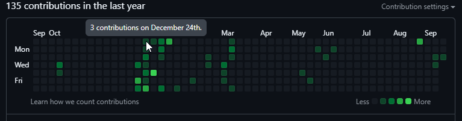

# Contents

## Programming paradigms & types of languages

A relatively top-to bottom beginner to advanced approach to paradigms and concepts like OOP, inheritance, diamond problem, etc.

Table of contents (level 1 and level 2 for OOP):

- Unstructured vs Structured
- High level vs Low level
- Compiled vs Interpreted
- Dynamically typed vs statically typed
- Imperative & Declarative
- Procedural programming
- Functional programming
- Data-driven programming
- Object-Oriented programming
  - Class-based vs prototype-based
  - The getters setters debate
  - Composition, inheritance, and delegation
  - Polymorphism
  - Ad hoc vs Subtyping
  - Behavioral subtyping
  - Object-orientation and databases
  - Object-relational mapping
  - Responsibility- vs. data-driven design
  - Criticism (OOP)
- Probabilistic Programming

Where not necessary, I did not use my own words - that is, most of the time.

It still counts as work in progress. I don't expect to make changes any time soon.

Sources:

- Wikipedia
- Python docs
- Linkedin official articles
- Direct embedded links
- Others

Markdown quotes also denote extra info, aside from actual quotes. Initial draft was written in Obsidian. Now I've shared it on GitHub (for the 2nd time).

Note that level 5 and 6 headings appear similar. Perhaps GitHub's stylistic render of Markdown needs adjustment as headings appear smaller than regular text.

Since this is a re-upload and I'm deleting the old repo, here's a snapshot of my contributions last year. A large number are a reflection of working on programming paradigms.

## Lorien

Notes taken on Lorien using a drawing pad.

Lorien features an [infinite canvas](https://github.com/mbrlabs/Lorien)
