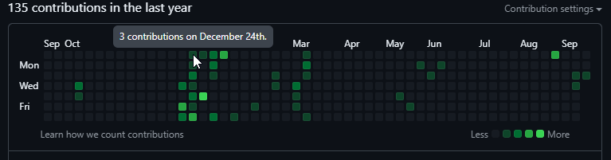

# Welcome to SWE theory

A collection of documents containing a top-to-bottom and simple-to-advanced set of useful concepts, theories, and knowledge.

This repository is a constant WIP.

## 1. Programming paradigms & types of languages

Learn about OOP, inheritance, the diamond problem, etc.

Contents:

- Unstructured vs Structured
- High level vs Low level
- Compiled vs Interpreted
- Dynamically typed vs statically typed
- Imperative & Declarative
- Procedural programming
- Functional programming
- Data-driven programming
- Object-Oriented programming
  - Class-based vs prototype-based
  - The getters setters debate
  - Composition, inheritance, and delegation
  - Polymorphism
  - Ad hoc vs Subtyping
  - Behavioral subtyping
  - Object-orientation and databases
  - Object-relational mapping
  - Responsibility- vs. data-driven design
  - Criticism (OOP)
- Probabilistic Programming

Paraphrasing wasn't required most of the time. \
Credit belongs to the original authors.

Primary sources:

- Wikipedia
- Python docs
- Linkedin articles

## Additional notes

- GitHub's Markdown renderer may need adjustment Level 5 and 6 headings appear similar.
- Markdown quotes are occasionally also used to denote bonus info, when the source isn't explicit.
- This repo started as a single Obsidian note and has been shared on GitHub twice.

Below is a snapshot of my contributions the year prior (2023-2024), most of which went to the first version of this repo and specifically the programming paradigms:

## Lorien

Some notes could best be saved visually on Lorien using a drawing pad. \
The DECO 03 was used. Lorien files can be downloaded and edited locally.

A feature I particularly like is its [infinite canvas](https://github.com/mbrlabs/Lorien)
